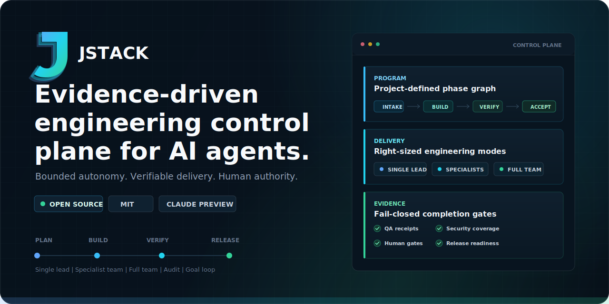
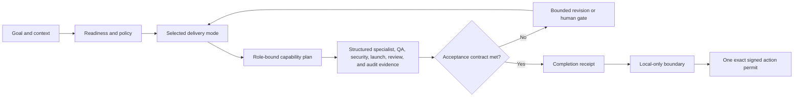
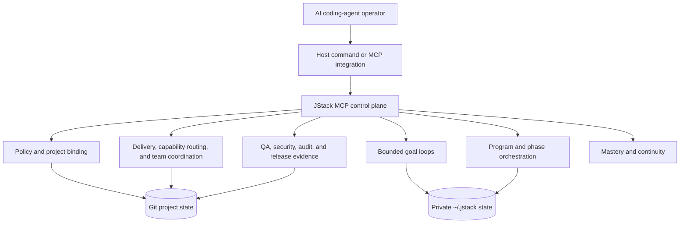

<div align="center">
  

  <h1>JStack</h1>
  <p><strong>Evidence-driven engineering control plane for AI coding agents.</strong></p>
  <p>Bounded autonomy. Verifiable delivery. Human authority.</p>

  <p>
    <a href="https://github.com/JarodFroneman/jstack/actions/workflows/ci.yml"></a>
    <a href="https://github.com/JarodFroneman/jstack/releases/latest"></a>
    <a href="LICENSE"></a>
    <a href="https://www.python.org/downloads/"></a>
    <a href="mcp/jstack/README.md"></a>
  </p>

  <p>
    <a href="#why-jstack">Why JStack</a> &middot;
    <a href="#operating-modes">Operating modes</a> &middot;
    <a href="#quick-start">Quick start</a> &middot;
    <a href="#architecture">Architecture</a> &middot;
    <a href="#trust-boundary">Trust boundary</a> &middot;
    <a href="#documentation">Documentation</a>
  </p>
</div>

---

JStack is an independent, open-source AI engineering workflow, plugin suite,
MCP control plane, and deliberate-practice system for professional
AI-assisted software delivery. It gives one engineer or a supervised team a
consistent operating model for planning, implementation, review, testing,
security, launch assurance, release readiness, durable goal loops, and
multi-phase programs.

Codex is the fully packaged host today. Claude Code can connect to JStack's
standards-based stdio MCP tool plane as a preview integration; host-native
commands and long-running continuation remain explicitly host-specific rather
than being presented as feature-equivalent.

> [!IMPORTANT]
> JStack does not declare generated code "enterprise-ready." It raises
> confidence through evidence bound to the actual project state, then reports
> what remains uncertain. Human engineers retain approval and release
> authority.

## Why JStack

AI can generate code quickly. Production engineering still depends on scope
control, independent checks, reproducible evidence, and accountable decisions.
JStack makes those controls explicit.

| Common failure mode | JStack control |
| --- | --- |
| A prompt drifts away from the real goal | Versioned goal contracts, non-goals, policy floors, and exact-digest confirmation |
| "Tests passed" exists only as prose | QA and security receipts tied to the exact Git revision, workspace, policy, and command |
| Multiple agents collide or duplicate work | Role permissions, write scopes, coordination packets, and controlled dispatch waves |
| A generic role receives a generic prompt | Versioned capability routing adds task-specific methods, evidence requirements, stop conditions, and audit/loop controls without granting new authority |
| A web/email/payment launch checklist is forgotten or applied to the wrong project | Explicit product surfaces select a versioned 37-control catalog and require fresh typed launch evidence |
| A long task loses context or loops forever | Durable state, bounded iteration, leases, circuit breakers, and explicit stop conditions |
| A large project is hardcoded into one giant prompt | Project-defined Program -> Phase dependency graphs with independently verified child goals |
| Release confidence, broad phase approval, or "deploy" becomes publication permission | Local-only default plus a signed, exact, short-lived, one-time permit for each repository, Git, release, deployment, or production action |

## Operating Modes

Choose the smallest operating mode that fits the work. The command is
authoritative; JStack never silently escalates staffing.

| Command | Operating model | Best fit |
| --- | --- | --- |
| `/j-stack-dev` | One Lead Engineer, no subagents | Focused implementation, debugging, maintenance, and contained releases |
| `/jstack-subagents` | Lead plus normally two or three specialists | Cross-cutting work that benefits from targeted security, test, architecture, or domain review |
| `/jstack-full-team` | Eleven professional roles dispatched in controlled waves | High-risk, broad, or release-critical changes requiring full functional coverage |
| `/jstack-loop` | A bounded durable goal loop composed with one selected delivery mode | Work that needs verified iteration across turns, human approvals, external waits, or multiple phases |
| `/jstack-audit` | Independent read-only inspection | Evidence-bound correctness, security, architecture, maintainability, performance, and release review |

`/jstack-loop <goal>` uses single-lead delivery by default. State `use JStack
Subagents` or `use JStack Full Team` in the same request when that staffing is
explicitly intended. Audit remains an independent inspection boundary and does
not edit project code.

### Specialist capabilities inside the five commands

JStack v0.8 upgrades the existing commands rather than adding a sixth command.
The selected delivery mode still decides who works and who may edit; a
deterministic capability plan then decides which task-specific methods each
selected role must apply. For example, an API change can route contract and
compatibility evidence to the existing Architect, Builder, Reviewer, QA, or
Security roles, while an authentication change can add trust-boundary and
negative-authorization evidence.

Every selected capability inherits the role's existing permissions. It cannot
turn a read-only Reviewer into a writer, add a role, widen a path scope, or
authorize deployment. Multi-agent work returns schema-validated specialist
results and privacy-safe telemetry metadata; a signed handoff is issued only
when every expected role is present, current, capability-matched, and free of
unresolved contradictions. See the
[specialist capability system](docs/specialist-capabilities.md).

## How It Works



JStack separates four concerns that ordinary prompts tend to collapse:

1. **Intent**: confirm the goal, context, non-goals, risk, scope, and acceptance
   contract.
2. **Execution**: select a right-sized delivery mode and constrain who may
   change what.
3. **Evidence**: bind tests, security coverage, review, approvals, and outputs
   to the current project state.
4. **Authority**: report verified completion without treating it as permission
   to create a repository, change a remote, commit, push, open a pull request,
   merge, tag, release, deploy, or mutate production.

## What Ships In v0.8

| Capability | What it provides |
| --- | --- |
| Delivery control | Planning, preflight, health, policy, team dispatch, deterministic review, and release-readiness tools |
| External-action boundary | Local-only default; independently signed exact challenges; session/Git/policy/remote/provider binding; exact branch-only or tag-only pushes; fresh target observation; destructive one-time consumption; 60-second single-operation permits |
| Evidence plane | Session-signed QA and security receipts, complete coverage checks, Git-state binding, and residual-risk reporting |
| Launch assurance | Explicit surface profiles, a versioned 37-control catalog, bounded typed evidence, fail-closed finalization, and a mandatory production launch receipt |
| Specialist capabilities | Pinned, versioned routing for 18 engineering, launch, testing, security, reliability, and handoff capability packs inside the existing five commands |
| Specialist handoff | Machine-validated result and telemetry schemas, per-role signed receipts, contradiction checks, and one current team-handoff receipt |
| Audit system | Read-only quick, standard, deep, and release profiles with deterministic finalization and SARIF output |
| Goal loops | Versioned contracts, private atomic state, one write lease per checkout, circuit breakers, checkpoints, revision, and terminal receipts |
| Program orchestration | Phase-count-agnostic dependency graphs, child-goal proofs, human and external gates, pause-aware budgets, invalidation, recovery, and final integrated evidence |
| Team coordination | Single-lead, specialist-team, and full-team modes with validated roles, permissions, scopes, and controlled waves |
| Mastery system | Separate ten-stage engineering, audit, and loop-engineering curricula with artifacts, assistance caps, repeated attempts, and blind capstones |
| Distribution | Five dedicated command plugins, one optional umbrella plugin, a standalone MCP server, transactional installers, and cross-platform CI |

The MCP exposes 53 canonical `jstack_*` tools, including 14 generic
`jstack_program_*` tools and the three-step `jstack_external_action_*`
authorization protocol plus the three-step `jstack_launch_*` evidence protocol,
in addition to the delivery, audit, loop, continuity, specialist-review, and
mastery families. Legacy `gstack_*` aliases remain available for compatibility.

## Host Compatibility

JStack separates its portable MCP control plane from host-specific command and
continuation surfaces.

| Host | Status | Available today |
| --- | --- | --- |
| Codex Desktop and Codex CLI | Full | Five command plugins, skills, prompts, MCP tools, subagent workflows, and native Goal composition |
| Claude Code | MCP preview | Manual local stdio MCP connection to the complete `jstack_*` tool inventory; Claude-native command packaging and continuation parity are not yet shipped |
| Other MCP-capable coding agents | Protocol-level | The JSONL stdio server may be connected manually, but unlisted hosts are not release-tested or claimed as supported |

The control plane is model-agnostic where the MCP protocol permits it. The
quality claim is deliberately narrower: a host is fully supported only when
its install, commands, permissions, continuation semantics, and evidence flow
are covered by JStack's release tests.

## Quick Start

### Requirements

- Codex Desktop or Codex CLI for the fully packaged workflow
- Claude Code for the optional MCP preview
- Git for commit-bound evidence and release controls
- Python 3.9 or newer
- macOS, Linux, or Windows

### 1. Clone

```bash
git clone https://github.com/JarodFroneman/jstack.git
cd jstack
```

### 2. Validate

```bash
python3 scripts/sync_artifacts.py --check
python3 -m unittest discover -s tests -v
python3 mcp/jstack/smoke_test.py
```

On Windows, replace `python3` with `python` where required.

### 3. Install In Codex

For the simplest transactional installation:

```bash
python3 scripts/install.py
```

PowerShell:

```powershell
.\scripts\install.ps1
```

The installer stages the complete payload, updates the Codex MCP
configuration, and restores prior targets if a later installation phase fails.

### 4. Restart And Verify

Restart Codex or open a new task, then confirm that the JStack commands and
`jstack_*` MCP tools are available. Run the installed MCP smoke test when
validating a managed environment.

For the clean five-plugin command layout, custom `CODEX_HOME` locations,
Claude Code MCP preview, upgrades, rollback, and duplicate-command prevention, read the
[installation guide](docs/installation.md).

## Architecture



The canonical MCP implementation lives in
[`mcp/jstack/jstack_mcp_server.py`](mcp/jstack/jstack_mcp_server.py). Generated
plugin copies are checked for drift, BOMs, version mismatch, and missing
artifacts before release.

### Control Layers

- **Project binding** distinguishes Git-backed and artifact-only workspaces.
- **Policy** defines non-overridable floors, trusted commands, protected paths,
  and release requirements.
- **Delivery** owns plans, staffing, permissions, scopes, and implementation.
- **Capabilities** add role-bound methods, required evidence, stop conditions,
  and audit/loop controls without expanding those permissions or scopes.
- **Evidence** owns current QA, security, audit, output, and approval proofs.
- **Loop** owns one bounded Phase -> Iteration convergence contract.
- **Program** owns a project-defined Program -> Phase dependency graph above
  bounded child loops.

Read [ARCHITECTURE.md](ARCHITECTURE.md) for the complete component and trust
model.

## Evidence And Release Model

JStack's release path fails closed when required evidence is absent, stale,
incomplete, or bound to a different project state. Depending on policy, the
release gate can require:

- a distinct pre-release base and clean committed candidate;
- complete committed, staged, unstaged, and untracked change evidence;
- current QA, security, deterministic review, and audit receipts;
- current specialist result and handoff receipts when multi-agent capability
  routing is used;
- complete current-tree and release-range secret scanning;
- explicit external approval, rollback, monitoring, and smoke-test references;
- one independently signed and destructively consumed exact authorization for
  each repository creation, remote add/change, commit, push, pull request,
  merge, tag, release, deployment, or production mutation;
- revalidation after any material change or downstream invalidation.

Completion means the acceptance contract passed. It does not grant protected
action authority.

Release readiness also never grants authority: its result always includes
`executionAuthorized=false`. Read the
[external-action authorization boundary](docs/external-action-boundary.md).

## Trust Boundary

> [!WARNING]
> JStack is an engineering control plane, not an operating-system sandbox or a
> compliance certification product.

- The QA runner closes stdin, avoids a shell, scrubs inherited variables,
  isolates `HOME`, caps output and time, and kills its process group. Project
  code still runs with the current user's filesystem and network privileges.
- Session-local receipts reduce accidental and caller-side evidence tampering;
  they do not protect against compromise of the same operating-system account.
- Specialist telemetry stores bounded identifiers, timing, status, counts, tool
  names/statuses, evidence references, and derived digests—not prompts,
  messages, tool arguments, model output, or secret values.
- Loop and program state under `~/.jstack/` is private local state, not a
  distributed lock or multi-tenant security boundary.
- Signed-local human gates and external-action attestations prove possession of
  a configured key. They are not enterprise identity, legal non-repudiation,
  or organizational approval.
- Audit receipts prove the collected scope, validated structure, and result
  calculation. They do not make every model-authored semantic finding true.
- Artifact-only projects can use planning and direct operator evidence, but
  cannot receive commit-bound JStack release receipts.

Use a container, VM, or hardened execution host for untrusted repositories.
Read [SECURITY.md](SECURITY.md) before adopting JStack in a production delivery
environment.

## Repository Map

| Path | Purpose |
| --- | --- |
| [`mcp/jstack/`](mcp/jstack/) | Canonical JSON-RPC server, capability registry, external-action authorization, delivery controls, audit, loop, program, schemas, curricula, and templates |
| [`skills/`](skills/) | Canonical single-lead, audit, and loop skills |
| [`prompts/`](prompts/) | Canonical slash-command prompts |
| [`plugins/`](plugins/) | Five dedicated command plugins |
| [`plugin/`](plugin/) | Optional all-in-one plugin with portable launcher |
| [`mastery/`](mastery/) | Engineering, audit, and loop curricula |
| [`tests/`](tests/) | Unit, transport, adversarial, release, mastery, installation, and orchestration tests |
| [`docs/`](docs/) | Operating models, protocols, migration guides, and architecture decisions |
| [`jstack.enterprise.json`](jstack.enterprise.json) | This repository's executable JStack policy |

## Development And Verification

```bash
python3 scripts/sync_artifacts.py --write
python3 scripts/sync_artifacts.py --check
python3 -m compileall -q mcp scripts tests
python3 -m unittest discover -s tests -v
python3 mcp/jstack/smoke_test.py
```

CI runs the same release-critical checks on Ubuntu, macOS, and Windows with
Python 3.9 and 3.12, including capability-routing, receipt-tamper, privacy,
artifact-parity, installation, and orchestration adversarial tests.

## Documentation

| Start here | Deep dive |
| --- | --- |
| [Installation and host compatibility](docs/installation.md) | [Architecture](ARCHITECTURE.md) |
| [Enterprise workflow](docs/enterprise-workflow.md) | [Agent coordination protocol](docs/agent-coordination-protocol.md) |
| [Team operating model](docs/team-operating-model.md) | [Audit system](docs/audit-system.md) |
| [Specialist capability system](docs/specialist-capabilities.md) | [Architecture decisions](docs/adr/) |
| [Launch assurance](docs/launch-assurance.md) | [v0.8 migration guide](docs/migration-0.8.md) |
| [Loop system](docs/loop-system.md) | [Program system](docs/program-system.md) |
| [Engineering mastery](docs/mastery-system.md) | [Loop mastery](docs/loop-mastery-system.md) |
| [v0.7 migration guide](docs/migration-0.7.md) | [External-action boundary](docs/external-action-boundary.md) |
| [v0.6 migration guide](docs/migration-0.6.md) | [Architecture decisions](docs/adr/) |
| [v0.5 migration guide](docs/migration-0.5.md) | [Third-party notices](THIRD_PARTY_NOTICES.md) |

## Governance

- Report security issues through [SECURITY.md](SECURITY.md).
- Read [CONTRIBUTING.md](CONTRIBUTING.md) before proposing changes.
- Review release history in [CHANGELOG.md](CHANGELOG.md) and
  [GitHub Releases](https://github.com/JarodFroneman/jstack/releases).
- JStack is distributed under the [MIT License](LICENSE).
- Third-party adaptations and pinned source provenance are documented in
  [THIRD_PARTY_NOTICES.md](THIRD_PARTY_NOTICES.md).

## Relationship To gstack

JStack is an independent project. Upstream gstack can provide optional extra
skills, but it is not a runtime dependency and is not required for any JStack
workflow.

---

<div align="center">
  <p><strong>Evidence before confidence.</strong></p>
  <p>Created and maintained by <a href="https://github.com/JarodFroneman">Jay Froneman</a>.</p>
</div>
