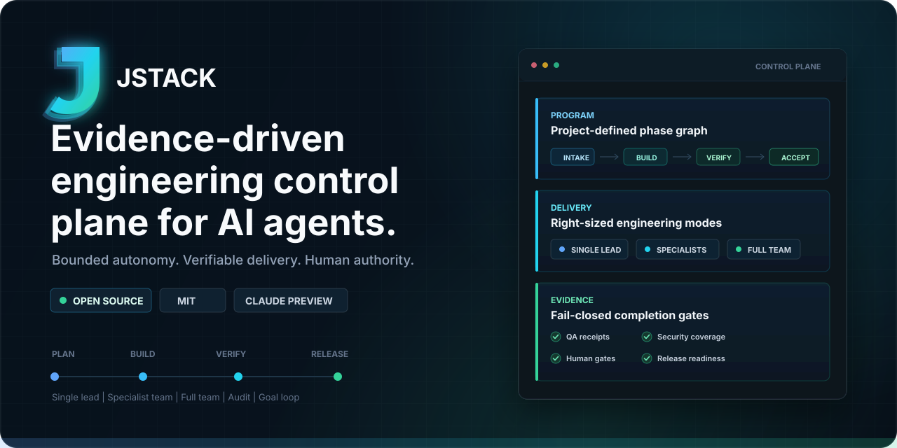
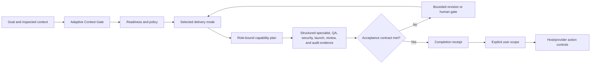
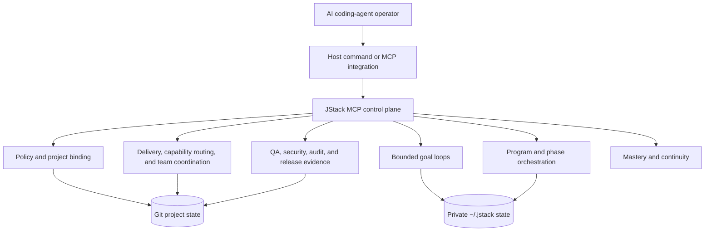

<div align="center">
  

  <h1>JStack</h1>
  <p><strong>Evidence-driven engineering control plane for AI coding agents.</strong></p>
  <p>Bounded autonomy. Verifiable delivery. Human authority.</p>

  <p>
    <a href="https://github.com/JarodFroneman/jstack/actions/workflows/ci.yml"></a>
    <a href="https://github.com/JarodFroneman/jstack/releases/latest"></a>
    <a href="LICENSE"></a>
    <a href="https://www.python.org/downloads/"></a>
    <a href="mcp/jstack/README.md"></a>
  </p>

  <p>
    <a href="#why-jstack">Why JStack</a> &middot;
    <a href="#operating-modes">Operating modes</a> &middot;
    <a href="#quick-start">Quick start</a> &middot;
    <a href="#architecture">Architecture</a> &middot;
    <a href="#trust-boundary">Trust boundary</a> &middot;
    <a href="#documentation">Documentation</a>
  </p>
</div>

---

JStack is an independent, open-source AI engineering workflow, plugin suite,
MCP control plane, and deliberate-practice system for professional
AI-assisted software delivery. It gives one engineer or a supervised team a
consistent operating model for planning, implementation, review, testing,
security, launch assurance, release readiness, durable goal loops, and
multi-phase programs.

Codex is the fully packaged host today. Claude Code can connect to JStack's
standards-based stdio MCP tool plane as a preview integration; host-native
commands and long-running continuation remain explicitly host-specific rather
than being presented as feature-equivalent.

> [!IMPORTANT]
> JStack does not declare generated code "enterprise-ready." It raises
> confidence through evidence bound to the actual project state, then reports
> what remains uncertain. Human engineers retain approval and release
> authority.

## Why JStack

AI can generate code quickly. Production engineering still depends on scope
control, independent checks, reproducible evidence, and accountable decisions.
JStack makes those controls explicit.

| Common failure mode | JStack control |
| --- | --- |
| A short prompt leaves the model to invent users, constraints, or "done" | Inspect-first Adaptive Context Gate with source attribution, disclosed assumptions, and at most three material questions with recommended defaults |
| A prompt drifts away from the real goal | Versioned goal contracts, non-goals, policy floors, and exact-digest confirmation |
| "Tests passed" exists only as prose | QA and security receipts tied to the exact Git revision, workspace, policy, and command |
| Multiple agents collide or duplicate work | Role permissions, write scopes, coordination packets, and controlled dispatch waves |
| A generic role receives a generic prompt | Versioned capability routing adds task-specific methods, evidence requirements, stop conditions, and audit/loop controls without granting new authority |
| A launch checklist is incomplete, under-scoped, or “passed” with prose | Risk floors and detected surface hints select 47 controls; JStack derives results from structured, target-bound assertions |
| A long task loses context or loops forever | Durable state, bounded iteration, leases, circuit breakers, and explicit stop conditions |
| A large project is hardcoded into one giant prompt | Project-defined Program -> Phase dependency graphs with independently verified child goals |
| Release confidence or a broad phase request silently triggers publication | Evidence remains separate from execution; external actions stay within explicit user scope and normal host/provider permissions, with no JStack token or terminal ceremony |

## Operating Modes

Choose the smallest operating mode that fits the work. The command is
authoritative; JStack never silently escalates staffing.

| Command | Operating model | Best fit |
| --- | --- | --- |
| `/j-stack-dev` | One Lead Engineer, no subagents | Focused implementation, debugging, maintenance, and contained releases |
| `/jstack-subagents` | Lead plus normally two or three specialists | Cross-cutting work that benefits from targeted security, test, architecture, or domain review |
| `/jstack-full-team` | Eleven professional roles dispatched in controlled waves | High-risk, broad, or release-critical changes requiring full functional coverage |
| `/jstack-loop` | A bounded durable goal loop composed with one selected delivery mode | Work that needs verified iteration across turns, human approvals, external waits, or multiple phases |
| `/jstack-audit` | Independent read-only inspection | Evidence-bound correctness, security, architecture, maintainability, performance, and release review |

`/jstack-loop <goal>` uses single-lead delivery by default. State `use JStack
Subagents` or `use JStack Full Team` in the same request when that staffing is
explicitly intended. Audit remains an independent inspection boundary and does
not edit project code.

### Specialist capabilities inside the five commands

JStack upgrades the existing commands rather than adding a sixth command.
The selected delivery mode still decides who works and who may edit; a
deterministic capability plan then decides which task-specific methods each
selected role must apply. For example, an API change can route contract and
compatibility evidence to the existing Architect, Builder, Reviewer, QA, or
Security roles, while an authentication change can add trust-boundary and
negative-authorization evidence.

Every selected capability inherits the role's existing permissions. It cannot
turn a read-only Reviewer into a writer, add a role, widen a path scope, or
authorize deployment. Multi-agent work returns schema-validated specialist
results and privacy-safe telemetry metadata; a signed handoff is issued only
when every expected role is present, current, capability-matched, and free of
unresolved contradictions. See the
[specialist capability system](docs/specialist-capabilities.md).

### Adaptive context inside the five commands

JStack v0.9.1 introduced repository and durable-context inspection before it
asks the user anything. Clear, specific prompts continue immediately. When an
answer could materially change scope, architecture, acceptance evidence, or
safety, JStack asks at most three questions in a round, explains why each
matters, and provides a recommended default. Repository-answerable questions
are forbidden.

Facts remain tagged as user, repository, policy, external evidence, or
inference; assumptions stay visible in the plan and handoff. Low-risk work may
continue on accepted defaults. High-risk security, financial, legal,
destructive, migration, or production gaps remain blocked until explicit
in-conversation confirmation. This is normal chat—not an approval token,
digest-paste, signer, mailbox, or terminal flow. See the
[v0.9.1 migration guide](docs/migration-0.9.1.md).

## How It Works


```mermaid
flowchart LR
    A[Goal and inspected context] --> Q[Adaptive Context Gate]
    Q --> B[Readiness and policy]
    B --> C[Selected delivery mode]
    C --> K[Role-bound capability plan]
    K --> D[Structured specialist, QA, security, launch, review, and audit evidence]
    D --> E{Acceptance contract met?}
    E -- No --> F[Bounded revision or human gate]
    F --> C
    E -- Yes --> G[Completion receipt]
    G --> H[Explicit user scope]
    H --> I[Host/provider action controls]
```

JStack separates four concerns that ordinary prompts tend to collapse:

1. **Intent**: confirm the goal, context, non-goals, risk, scope, and acceptance
   contract.
2. **Execution**: select a right-sized delivery mode and constrain who may
   change what.
3. **Evidence**: bind tests, security coverage, review, approvals, and outputs
   to the current project state.
4. **Action safety**: keep evidence separate from execution and perform
   repository, Git, provider, deployment, or production actions only within
   explicit user scope and normal host/provider permissions.

## What Is In The v0.10.0-beta.1 Candidate

> **Unreleased candidate:** the product code may identify itself as
> `0.10.0-beta.1`, but ADR 0021's image, execution, independent-review,
> evidence, release, and deployment gates have not yet passed. Do not treat
> this checkout as a validated or published Beta.1 release.

| Capability | What it provides |
| --- | --- |
| Beta.1 Proof Plane | Uninstalled maintainer infrastructure for exact 18-image qualification, reviewed task artifacts, 216 write-once attempts, delayed grading, 432 signed blinded reviews, and independently signed evidence verification; until those external gates run, it proves implementation integrity only and makes no performance or release claim |
| Safe Security Operator Stage 0 | Two inert, deterministic audit-mastery labs for CIA, authorization, hostile-repository instruction handling, no-execution/no-network/no-secret boundaries, private coordinated disclosure, and explicit non-authority; Stage 0 does not scan, exploit, patch, publish, deploy, or access production |
| Repository Reconnaissance Stage 1 | A closed `jstack.audit.repository-map.v1` contract that binds static maps to exact Git HEAD/tree state, requires all eight system surfaces, hash-verified source-line citations, graph and trust-boundary integrity, generated-artifact provenance/drift classification, explicit gaps and limitations, and two deterministic independent passes |
| Correctness And Reliability Stage 2 | Closed report and reproduction contracts for exact-Git-bound logic, state-transition, error-handling, and reliability evidence; strong claims require current source hashes, violated invariants, reciprocal static or exact-QA reproductions, complete regression plans, and two deterministic independent passes |
| Security And Threat-Modelling Stage 3 | A closed static threat-model contract with complete STRIDE classification, exact-Git-bound citations, assets, bounded adversaries, trust boundaries, controls, reciprocal abuse cases and verified reachable attack paths, critical-blocker enforcement, pinned versioned standards mappings, secret-safe narratives, and two deterministic independent passes |
| Maintainability And Architecture Stage 4 | A closed baseline/candidate architecture contract covering module boundaries, dependency direction, contracts and compatibility, change amplification, testability, and migration risk; static audits propose only, while implementation attempts verify one separately authorized committed remediation against the exact Git diff and current passing JStack QA evidence |
| Performance And Resource Efficiency Stage 5 | Closed workload, capture, results, and finding contracts with signed exact-Git/workload/command/environment/sample binding; JStack recomputes percentiles, budgets, improvements, and guardrail regressions, while Audit remains non-executing and implementation evidence must come from a separately authorized committed workflow |
| Supply-Chain, Build And Release Integrity Stage 6 | Closed exact-Git inventory and report contracts across major dependency ecosystems; JStack independently enumerates tracked inputs, parses GitHub Actions pins and permissions, verifies source-to-artifact graphs, provenance, generated-copy drift, complete signed dependency-scanner evidence (including optional offline OSV coverage), all discovered QA commands, and one separately committed hardening diff |
| Dynamic And Adversarial Verification Stage 7 | Closed exact-revision campaign/capture contracts with deterministic two-run outcomes, eight explicit adversarial categories, signed command/environment/case bindings, reciprocal hypothesis and false-positive analysis, current QA/security evidence, and strict baseline/candidate harness comparison while Audit remains read-only |
| Enterprise Audit Lead Stage 8 | Exact reconciliation of a current signed Git-bound release audit, finalized finding/result contract, deterministic SARIF 2.1.0, priority-first risk ownership, explicit accepted-risk governance, derived go/no-go, canonical engineering/executive reporting, and a strict prior-validated-baseline-to-current committed remediation comparison while Audit remains read-only |
| Adaptive context | Inspect-first source attribution, disclosed and plan-visible assumptions, a three-question maximum with recommended defaults, non-lowerable high-risk behavior, digest-verified briefs, exact audit-selector binding, and stale-state-bound planning receipts across the existing five commands |
| Delivery control | Planning, preflight, health, policy, team dispatch, deterministic review, and release-readiness tools |
| Host-native action safety | No JStack approval challenge, token, signer, mailbox, or terminal command; explicit user scope plus ordinary Codex/provider permissions govern external operations |
| Evidence plane | Session-signed QA and security receipts, complete coverage checks, Git-state binding, and residual-risk reporting |
| Launch assurance | 22 explicit surfaces, four non-lowerable risk tiers, a versioned 47-control catalog, static hint reconciliation, composite structured evidence, independent high-risk scanning, and fail-closed production receipts |
| Specialist capabilities | Pinned, versioned routing for 18 engineering, launch, testing, security, reliability, and handoff capability packs inside the existing five commands |
| Specialist handoff | Machine-validated result and telemetry schemas, per-role signed receipts, contradiction checks, and one current team-handoff receipt |
| Audit system | Read-only quick, standard, deep, and release profiles with deterministic finalization and SARIF output |
| Goal loops | Versioned contracts, private atomic state, one write lease per checkout, circuit breakers, checkpoints, revision, and terminal receipts |
| Program orchestration | Phase-count-agnostic dependency graphs, child-goal proofs, human and external gates, pause-aware budgets, invalidation, recovery, and final integrated evidence |
| Team coordination | Single-lead, specialist-team, and full-team modes with validated roles, permissions, scopes, and controlled waves |
| Mastery system | Separate ten-stage engineering, audit, and loop-engineering curricula with artifacts, assistance caps, repeated attempts, and blind capstones |
| Distribution | Five dedicated command plugins, one optional umbrella plugin, a standalone MCP server, transactional installers, and cross-platform CI |

The MCP exposes 52 canonical `jstack_*` tools, including the shared
`jstack_context_readiness` gate, 13 generic
`jstack_program_*` tools and the three-step `jstack_launch_*` evidence
protocol, plus `jstack_performance_capture`, `jstack_adversarial_capture`, and the delivery, audit, loop, continuity,
specialist-review, and mastery families. Legacy `gstack_*` aliases remain
available for compatibility.

The four shared-gate workflows pass the gate's `readinessReceipt` and exact
`normalizedBrief` forward as `context_readiness_receipt` and `context_brief`.
Planning verifies the pair so sourced facts, disclosed assumptions, and exact
Audit selectors cannot be silently changed after intake.

### Development-only Proof Plane

The [Proof Plane](evals/README.md) surrounds the installed product without
expanding it. Alpha.10 validates five versioned benchmark contracts, a
six-family public development manifest, content digests, deterministic mock
execution and scoring, exact execution-plan completeness, and the frozen
alpha.9 product surface. Expected runs are manifest-bound so omitted failures
cannot vanish from the denominator, while controlled comparisons bind host,
model, JStack, environment, allowed tools, tool-call limits, and budgets. Its
mock results are protocol fixtures—not evidence that JStack beats plain
prompting, that Codex beats Claude, or that JStack finds every security defect.
Real-project tasks, host runners, external pilots, evidence bridges, and public
aggregate reports remain later measured milestones.

## Host Compatibility

JStack separates its portable MCP control plane from host-specific command and
continuation surfaces.

| Host | Status | Available today |
| --- | --- | --- |
| Codex Desktop and Codex CLI | Full | Five command plugins, skills, prompts, MCP tools, subagent workflows, and native Goal composition |
| Claude Code | MCP preview | Manual local stdio MCP connection to the complete `jstack_*` tool inventory; Claude-native command packaging and continuation parity are not yet shipped |
| Other MCP-capable coding agents | Protocol-level | The JSONL stdio server may be connected manually, but unlisted hosts are not release-tested or claimed as supported |

The control plane is model-agnostic where the MCP protocol permits it. The
quality claim is deliberately narrower: a host is fully supported only when
its install, commands, permissions, continuation semantics, and evidence flow
are covered by JStack's release tests.

## Quick Start

### Requirements

- Codex Desktop or Codex CLI for the fully packaged workflow
- Claude Code for the optional MCP preview
- Git for commit-bound evidence and release controls
- Python 3.9 or newer
- macOS, Linux, or Windows

### 1. Clone

```bash
git clone https://github.com/JarodFroneman/jstack.git
cd jstack
```

### 2. Validate

```bash
python3 scripts/sync_artifacts.py --check
python3 -m unittest discover -s tests -v
python3 mcp/jstack/smoke_test.py
```

On Windows, replace `python3` with `python` where required.

### 3. Install In Codex

For the simplest transactional installation:

```bash
python3 scripts/install.py
```

PowerShell:

```powershell
.\scripts\install.ps1
```

The installer stages the complete payload, updates the Codex MCP
configuration, and restores prior targets if a later installation phase fails.

### 4. Restart And Verify

Restart Codex or open a new task, then confirm that the JStack commands and
`jstack_*` MCP tools are available. Run the installed MCP smoke test when
validating a managed environment.

For the clean five-plugin command layout, custom `CODEX_HOME` locations,
Claude Code MCP preview, upgrades, rollback, and duplicate-command prevention, read the
[installation guide](docs/installation.md).

## Architecture


```mermaid
flowchart TB
    U[AI coding-agent operator] --> H[Host command or MCP integration]
    H --> M[JStack MCP control plane]

    M --> P[Policy and project binding]
    M --> D[Delivery, capability routing, and team coordination]
    M --> E[QA, security, audit, and release evidence]
    M --> L[Bounded goal loops]
    M --> R[Program and phase orchestration]
    M --> T[Mastery and continuity]

    P --> G[(Git project state)]
    D --> G
    E --> G
    L --> X[(Private ~/.jstack state)]
    R --> X
```

The canonical MCP implementation lives in
[`mcp/jstack/jstack_mcp_server.py`](mcp/jstack/jstack_mcp_server.py). Generated
plugin copies are checked for drift, BOMs, version mismatch, and missing
artifacts before release.

### Control Layers

- **Project binding** distinguishes Git-backed and artifact-only workspaces.
- **Adaptive context** distinguishes sourced facts, assumptions, material gaps,
  and safe defaults before planning or audit execution.
- **Policy** defines non-overridable floors, trusted commands, protected paths,
  and release requirements.
- **Delivery** owns plans, staffing, permissions, scopes, and implementation.
- **Capabilities** add role-bound methods, required evidence, stop conditions,
  and audit/loop controls without expanding those permissions or scopes.
- **Evidence** owns current QA, security, audit, output, and approval proofs.
- **Loop** owns one bounded Phase -> Iteration convergence contract.
- **Program** owns a project-defined Program -> Phase dependency graph above
  bounded child loops.

Read [ARCHITECTURE.md](ARCHITECTURE.md) for the complete component and trust
model.

## Evidence And Release Model

JStack's release path fails closed when required evidence is absent, stale,
incomplete, or bound to a different project state. Depending on policy, the
release gate can require:

- a distinct pre-release base and clean committed candidate;
- complete committed, staged, unstaged, and untracked change evidence;
- current QA, security, deterministic review, and audit receipts;
- current specialist result and handoff receipts when multi-agent capability
  routing is used;
- complete current-tree and release-range secret scanning;
- explicit release approval, rollback, monitoring, and smoke-test references;
- revalidation after any material change or downstream invalidation.

Completion means the acceptance contract passed. It does not execute an
external action or widen task scope.

Release readiness is evidence only: its result always includes
`executionAuthorized=false`. Read
[Host-Native Action Safety](docs/action-safety.md).

## Trust Boundary

> [!WARNING]
> JStack is an engineering control plane, not an operating-system sandbox or a
> compliance certification product.

- The QA runner closes stdin, avoids a shell, scrubs inherited variables,
  isolates `HOME`, caps output and time, and kills its process group. Project
  code still runs with the current user's filesystem and network privileges.
- Session-local receipts reduce accidental and caller-side evidence tampering;
  they do not protect against compromise of the same operating-system account.
- Specialist telemetry stores bounded identifiers, timing, status, counts, tool
  names/statuses, evidence references, and derived digests—not prompts,
  messages, tool arguments, model output, or secret values.
- Loop and program state under `~/.jstack/` is private local state, not a
  distributed lock or multi-tenant security boundary.
- Program human gates are caller-supplied conversational decision records.
  They are not enterprise identity, legal non-repudiation, or organizational
  approval.
- JStack has no custom action-approval token or terminal flow. Stronger
  separation of duties belongs in host and provider controls.
- Audit receipts prove the collected scope, validated structure, and result
  calculation. They do not make every model-authored semantic finding true.
- Audit mastery Stage 0 uses only inert local scenarios and writes only declared
  training artifacts under `.jstack-training/`; passing it grants no execution,
  remediation, publication, release, deployment, or production authority.
- Audit mastery Stage 1 reads only the current committed source snapshot and
  writes only its three declared training artifacts under `.jstack-training/`.
  Its pass proves structural and citation-contract compliance—not semantic
  completeness, vulnerability absence, scanning, remediation, or production
  authority.
- Audit mastery Stage 2 writes only its report, invariant narrative, and
  reproduction manifest under `.jstack-training/`. Static counterexamples run
  nothing; executed cases require an exact-revision passing JStack QA receipt.
  JStack QA is environment-hardened but is not an OS or network sandbox, and a
  Stage 2 pass grants no patch, release, deployment, or production authority.
- Audit mastery Stage 3 writes only its threat-model narrative, closed security
  report, and abuse-case narrative under `.jstack-training/`. It performs no
  repository execution, live exploitation, network or secret access, exploit-
  payload retention, remediation, publication, or production action. A Stage 3
  pass proves evidence-contract integrity—not vulnerability absence,
  exploitability, zero-day detection, standards compliance, or production
  security.
- Audit mastery Stage 4 reads immutable baseline/candidate Git objects and may
  write only its three declared architecture training artifacts. Audit proposes
  rather than edits; implementation evidence must already be committed and
  match current QA. A pass does not prove an optimal architecture or grant
  remediation or production authority.
- Audit mastery Stage 5 may write only its three declared performance training
  artifacts. Audit never executes a benchmark or optimizes code. Captures come
  from a separately authorized discovered command and are signed against the
  exact Git tree, workload, command, local environment, and normalized samples.
  JStack recomputes statistics and guardrail regressions, but local capture is
  not an OS or network sandbox and does not prove workload realism, measurement
  accuracy, production capacity, or production authority.
- Audit mastery Stage 6 may write only its dependency inventory, build trace,
  and supply-chain report under `.jstack-training/`. The evaluator reads
  immutable Git objects, recomputes tracked-input and CI-control evidence, and
  requires a current complete receipt for a passed curated dependency analyzer
  plus every discovered QA command. It performs no package resolution,
  registry access, hardening, or release action, and a pass does not prove
  complete transitive dependencies, reproducible builds, artifact
  authenticity, vulnerability absence, or production authority.
- Audit mastery Stage 7 may write only its adversarial plan, closed
  verification-results envelope, and false-positive analysis under
  `.jstack-training/`. Audit never runs the target or implements a harness;
  captures come from a separately authorized discovered test command and bind
  the exact Git tree, campaign, command, local environment, deterministic
  two-run case set, and digested outcomes. Current QA and security receipts are
  mandatory. Local capture is not an OS or network sandbox, an observed lack
  of external effects is not enforced isolation, and a pass does not prove
  vulnerability absence, exploitability, zero-day detection, release
  readiness, production safety, or production authority.
- Audit mastery Stage 8 may write only its release audit report, finalized
  audit result, deterministic SARIF, and risk register under
  `.jstack-training/`. The evaluator reconciles them with a fresh complete
  release-profile receipt and permits no other dirty path. Every finding must
  have one priority-first owner/disposition record; accepted risk requires the
  exact owner, reason, approval, future expiry, compensating control, and
  residual risk. The controls drill verifies a separately committed candidate
  against a prior passed, Git-immutable Stage 8 baseline and rejects missing
  remediation or detected regression. Audit cannot accept risk, edit code,
  change Git, release, deploy, or access production, and a pass does not prove
  vulnerability absence, zero-day detection, release authorization, or
  production safety.
- Artifact-only projects can use planning and direct operator evidence, but
  cannot receive commit-bound JStack release receipts.

Use a container, VM, or hardened execution host for untrusted repositories.
Read [SECURITY.md](SECURITY.md) before adopting JStack in a production delivery
environment.

## Repository Map

| Path | Purpose |
| --- | --- |
| [`mcp/jstack/`](mcp/jstack/) | Canonical JSON-RPC server, capability registry, delivery controls, audit, loop, program, schemas, curricula, and templates |
| [`skills/`](skills/) | Canonical single-lead, audit, and loop skills |
| [`prompts/`](prompts/) | Canonical slash-command prompts |
| [`plugins/`](plugins/) | Five dedicated command plugins |
| [`plugin/`](plugin/) | Optional all-in-one plugin with portable launcher |
| [`mastery/`](mastery/) | Engineering, audit, and loop curricula |
| [`evals/`](evals/) | Development-only Proof Plane contracts, manifest, lock, mock runner, and deterministic scorer; never installed into JStack core |
| [`tests/`](tests/) | Unit, transport, adversarial, release, mastery, installation, and orchestration tests |
| [`docs/`](docs/) | Operating models, protocols, migration guides, and architecture decisions |
| [`jstack.enterprise.json`](jstack.enterprise.json) | This repository's executable JStack policy |

## Development And Verification

```bash
python3 scripts/sync_artifacts.py --write
python3 scripts/sync_artifacts.py --check
python3 scripts/check_contract_compatibility.py
python3 scripts/check_product_boundaries.py
python3 -m evals.runner.cli verify-lock
python3 -m compileall -q mcp scripts tests evals
python3 -m unittest discover -s tests -v
python3 mcp/jstack/smoke_test.py
```

CI runs the same release-critical checks on Ubuntu, macOS, and Windows with
Python 3.9 and 3.12, including capability-routing, receipt-tamper, privacy,
artifact-parity, installation, orchestration, alpha.9 contract compatibility,
Proof Plane integrity, and permanent product-boundary tests.

## Documentation

| Start here | Deep dive |
| --- | --- |
| [Installation and host compatibility](docs/installation.md) | [Architecture](ARCHITECTURE.md) |
| [v0.10.0-beta.1 candidate migration guide](docs/migration-0.10.0-beta.1.md) | [Beta.1 Codex Proof Study decision](docs/adr/0021-beta1-codex-proof-study.md) |
| [v0.10.0-alpha.10 migration guide](docs/migration-0.10.0-alpha.10.md) | [Proof Foundation decision](docs/adr/0020-proof-foundation.md) |
| [v0.10.0-alpha.9 migration guide](docs/migration-0.10.0-alpha.9.md) | [Enterprise Audit Lead decision](docs/adr/0019-enterprise-audit-lead-stage8.md) |
| [v0.10.0-alpha.8 migration guide](docs/migration-0.10.0-alpha.8.md) | [Dynamic and Adversarial Verification decision](docs/adr/0018-dynamic-adversarial-verification-stage7.md) |
| [v0.10.0-alpha.7 migration guide](docs/migration-0.10.0-alpha.7.md) | [Supply-Chain, Build and Release Integrity decision](docs/adr/0017-supply-chain-build-release-stage6.md) |
| [v0.10.0-alpha.6 migration guide](docs/migration-0.10.0-alpha.6.md) | [Performance and Resource Efficiency decision](docs/adr/0016-performance-resources-stage5.md) |
| [v0.10.0-alpha.5 migration guide](docs/migration-0.10.0-alpha.5.md) | [Maintainability and Architecture decision](docs/adr/0015-maintainability-architecture-stage4.md) |
| [v0.10.0-alpha.4 migration guide](docs/migration-0.10.0-alpha.4.md) | [Security and Threat-Modelling decision](docs/adr/0014-security-threat-model-stage3.md) |
| [Enterprise workflow](docs/enterprise-workflow.md) | [Agent coordination protocol](docs/agent-coordination-protocol.md) |
| [Team operating model](docs/team-operating-model.md) | [Audit system](docs/audit-system.md) |
| [Specialist capability system](docs/specialist-capabilities.md) | [Architecture decisions](docs/adr/) |
| [v0.10.0-alpha.3 migration guide](docs/migration-0.10.0-alpha.3.md) | [Correctness and Reliability decision](docs/adr/0013-correctness-reliability-stage2.md) |
| [v0.10.0-alpha.2 migration guide](docs/migration-0.10.0-alpha.2.md) | [Repository Reconnaissance decision](docs/adr/0012-repository-reconnaissance-stage1.md) |
| [v0.10.0-alpha.1 migration guide](docs/migration-0.10.0-alpha.1.md) | [Safe Security Operator decision](docs/adr/0011-safe-security-operator-stage0.md) |
| [v0.9.1 migration guide](docs/migration-0.9.1.md) | [Adaptive Context Gate decision](docs/adr/0010-adaptive-context-gate.md) |
| [Launch assurance](docs/launch-assurance.md) | [v0.9 migration guide](docs/migration-0.9.md) |
| [Loop system](docs/loop-system.md) | [Program system](docs/program-system.md) |
| [Engineering mastery](docs/mastery-system.md) | [Loop mastery](docs/loop-mastery-system.md) |
| [v0.8.2 migration guide](docs/migration-0.8.2.md) | [Host-native action safety](docs/action-safety.md) |
| [v0.8.1 migration guide](docs/migration-0.8.1.md) | [v0.8 migration guide](docs/migration-0.8.md) |
| [v0.6 migration guide](docs/migration-0.6.md) | [Architecture decisions](docs/adr/) |
| [v0.5 migration guide](docs/migration-0.5.md) | [Third-party notices](THIRD_PARTY_NOTICES.md) |

## Governance

- Report security issues through [SECURITY.md](SECURITY.md).
- Read [CONTRIBUTING.md](CONTRIBUTING.md) before proposing changes.
- Review release history in [CHANGELOG.md](CHANGELOG.md) and
  [GitHub Releases](https://github.com/JarodFroneman/jstack/releases).
- JStack is distributed under the [MIT License](LICENSE).
- Third-party adaptations and pinned source provenance are documented in
  [THIRD_PARTY_NOTICES.md](THIRD_PARTY_NOTICES.md).

## Relationship To gstack

JStack is an independent project. Upstream gstack can provide optional extra
skills, but it is not a runtime dependency and is not required for any JStack
workflow.

---

<div align="center">
  <p><strong>Evidence before confidence.</strong></p>
  <p>Created and maintained by <a href="https://github.com/JarodFroneman">Jay Froneman</a>.</p>
</div>
