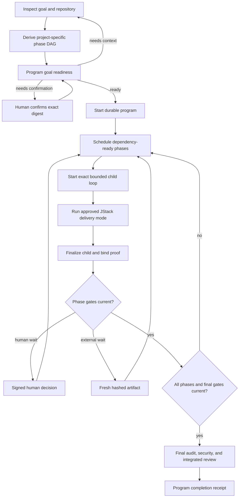

# JStack Program System

JStack 0.5 adds a durable orchestration layer for projects whose real outcome
contains multiple independently verified phases. It composes existing bounded
loops; it does not replace them.

## When To Use It

Use a program when at least one of these is true:

- deliverables have real dependency relationships;
- phases need different scopes, risks, autonomy, or approved JStack teams;
- work pauses for named human decisions or external evidence;
- phase outputs need durable hashes and downstream invalidation; or
- final integration evidence is distinct from phase evidence.

Use one loop when one coherent acceptance boundary is enough. There is no
preferred phase count. The roadmap may contain any valid number of phases from
one up to the policy ceiling; the project contract decides.

## Lifecycle

## Tool Families

- Intake: `jstack_program_goal_readiness`, `jstack_program_start`
- Recovery: `jstack_program_status`, `jstack_program_next`
- Child proof: `jstack_program_phase_bind`,
  `jstack_program_phase_complete`
- Interventions: `jstack_program_gate_challenge`,
  `jstack_program_gate_resolve`, `jstack_program_evidence_register`
- Lifecycle: `jstack_program_pause`, `jstack_program_resume`,
  `jstack_program_revise`, `jstack_program_cancel`,
  `jstack_program_finalize`

Read-only calls may be repeated freely. Every state-changing call requires a
unique operation ID and is transactionally retry-safe.

## Team Composition

The program does not introduce a fifth editing team. Each phase uses one
existing mode:

| Phase mode | Authority |
| --- | --- |
| `single-lead` | JStack Dev, no subagents |
| `smart-subagents` | Lead plus explicitly approved specialists |
| `full-team` | Explicitly approved full 11-role workflow |

Mode assignments are part of the confirmed phase contract. A large project
does not silently escalate staffing. Audit remains an independent read-only
acceptance gate.

## Human Oversight

Human intervention is a first-class state, not a workaround. A phase or final
gate can require named roles and quorum. The MCP emits an exact challenge; the
human signs it outside Codex; the MCP verifies identity, role, decision,
contract, gate, nonce, and expiry. Waiting pauses active time and releases a
child loop's write lease at a safe checkpoint.

External systems use hashed artifact gates with provenance and freshness.
Examples include backtest reports, hardware tests, data exports, or compliance
records. Replaced or stale evidence invalidates downstream assumptions.

## Recovery And Auditability

On every resumed task, status validates contract history, event hashes,
snapshot binding, pending transactions, policy/tool context, baseline
ancestry, durable child proofs, and optionally output hashes. A mismatch blocks
mutation until an approved revision or recovery action.

Programs live under `~/.jstack/programs`; live manifests never mount into the
repository. JSON Schemas under `mcp/jstack/schemas` let integrations validate
contracts, gates, evidence, and status independently.

## Completion Boundary

Finalization requires all current child and gate proof plus current final
criteria. The default enterprise floor requires release-profile audit,
security, and deterministic integrated review. Project contracts can require
additional QA commands or artifacts.

Completion proves the current contract and Git subject. It does not authorize
publishing, deployment, or production changes. Those remain separate JStack
release gates and explicit user decisions.

If the Git subject changes after completion, the same unchanged contract may
be finalized again with fresh evidence. JStack replaces the current completion
proof and preserves the prior proof in its hash-chained history.

See [ADR 0004](adr/0004-program-orchestration-protocol.md),
[loop system](loop-system.md), and [migration guide](migration-0.5.md).
